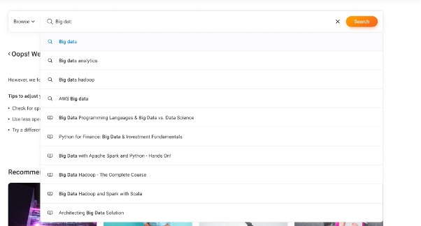

## Тестовое задание - React, Node (Koa.js), Postgresql.

Реализовать поиск, который включает себя UI элемент (см. скриншот) в виде инпута и списка suggestions (кнопку Browse можно проигнорировать) и эндпоинт, который присылает suggestions по мере ввода символов в строку поиска (применения debounce на клиенте будет плюсом).
На основе файла cities.csv создать таблицу в БД, по которой и будет осуществляться поиск, а также сопутствующую backend логику.

Опционально:
Реализовать полнотекстовый поиск средствами Postgresql
